<!-- generated by `frx flow --md` — do not edit, re-run it -->

# FlowEditorPage

`app/lib/connectors/flow_editor_page_connector.dart`

## onBack

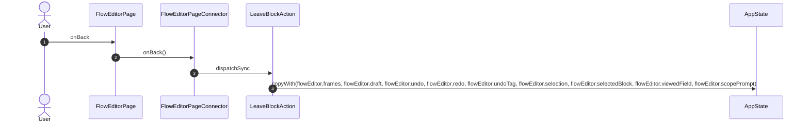
```mermaid
sequenceDiagram
    autonumber
    actor User
    participant UI as FlowEditorPage
    participant VM as FlowEditorPageConnector
    participant A1 as LeaveBlockAction
    participant ST as AppState

    User->>UI: onBack
    UI->>VM: onBack()
    VM->>A1: dispatchSync
    A1->>ST: copyWith(flowEditor.frames, flowEditor.draft, flowEditor.undo, flowEditor.redo, flowEditor.undoTag, flowEditor.selection, flowEditor.selectedBlock, flowEditor.viewedField, flowEditor.scopePrompt)
```

## onTreeToggle

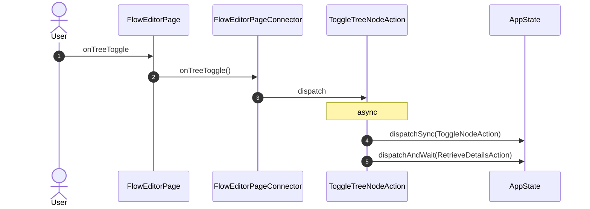
```mermaid
sequenceDiagram
    autonumber
    actor User
    participant UI as FlowEditorPage
    participant VM as FlowEditorPageConnector
    participant A1 as ToggleTreeNodeAction
    participant ST as AppState

    User->>UI: onTreeToggle
    UI->>VM: onTreeToggle()
    VM->>A1: dispatch
    Note over A1: async
    A1->>ST: dispatchSync(ToggleNodeAction)
    A1->>ST: dispatchAndWait(RetrieveDetailsAction)
```

## onTreeQuery

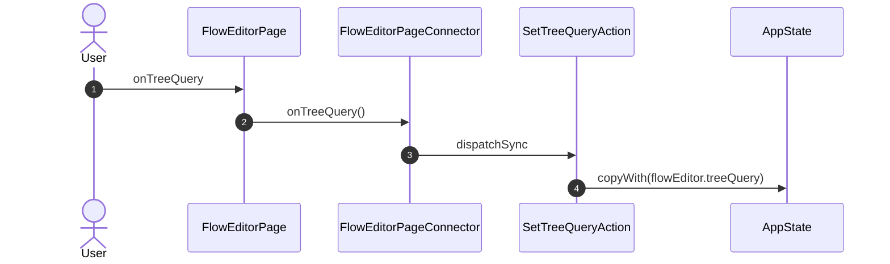
```mermaid
sequenceDiagram
    autonumber
    actor User
    participant UI as FlowEditorPage
    participant VM as FlowEditorPageConnector
    participant A1 as SetTreeQueryAction
    participant ST as AppState

    User->>UI: onTreeQuery
    UI->>VM: onTreeQuery()
    VM->>A1: dispatchSync
    A1->>ST: copyWith(flowEditor.treeQuery)
```

## onPlace

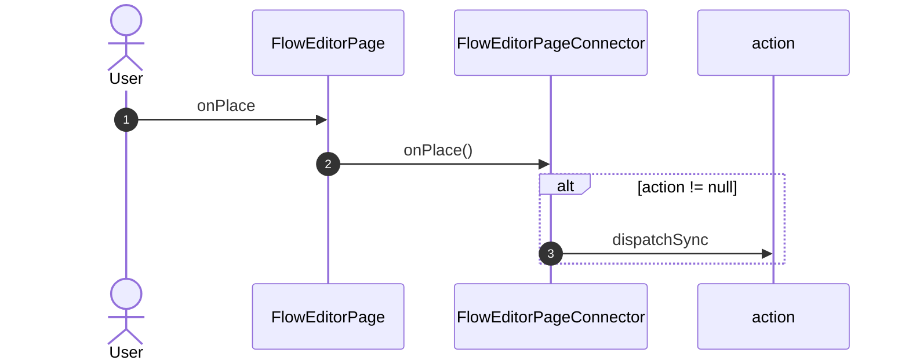
```mermaid
sequenceDiagram
    autonumber
    actor User
    participant UI as FlowEditorPage
    participant VM as FlowEditorPageConnector
    participant A1 as action

    User->>UI: onPlace
    UI->>VM: onPlace()
    alt action != null
        VM->>A1: dispatchSync
    end
```

## onPaletteMenu

```mermaid
sequenceDiagram
    autonumber
    actor User
    participant UI as FlowEditorPage
    participant VM as FlowEditorPageConnector
    participant A1 as action

    User->>UI: onPaletteMenu
    UI->>VM: onPaletteMenu()
    alt action != null
        VM->>A1: dispatchSync
    end
```

## onRenameBlock

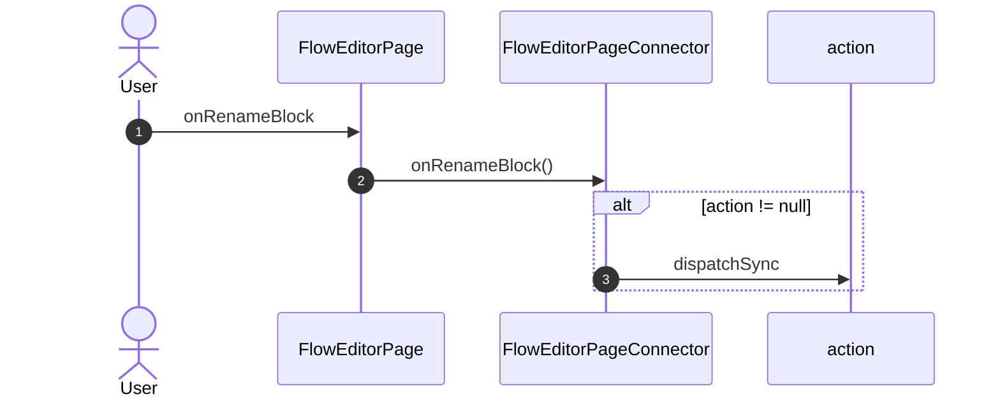
```mermaid
sequenceDiagram
    autonumber
    actor User
    participant UI as FlowEditorPage
    participant VM as FlowEditorPageConnector
    participant A1 as action

    User->>UI: onRenameBlock
    UI->>VM: onRenameBlock()
    alt action != null
        VM->>A1: dispatchSync
    end
```

## onTreePlace

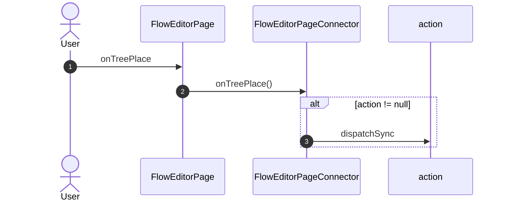
```mermaid
sequenceDiagram
    autonumber
    actor User
    participant UI as FlowEditorPage
    participant VM as FlowEditorPageConnector
    participant A1 as action

    User->>UI: onTreePlace
    UI->>VM: onTreePlace()
    alt action != null
        VM->>A1: dispatchSync
    end
```

## onCreateBlock

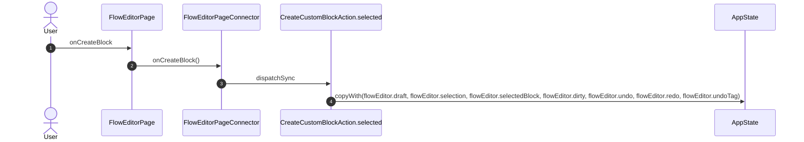
```mermaid
sequenceDiagram
    autonumber
    actor User
    participant UI as FlowEditorPage
    participant VM as FlowEditorPageConnector
    participant A1 as CreateCustomBlockAction.selected
    participant ST as AppState

    User->>UI: onCreateBlock
    UI->>VM: onCreateBlock()
    VM->>A1: dispatchSync
    A1->>ST: copyWith(flowEditor.draft, flowEditor.selection, flowEditor.selectedBlock, flowEditor.dirty, flowEditor.undo, flowEditor.redo, flowEditor.undoTag)
```

## onPromptSave

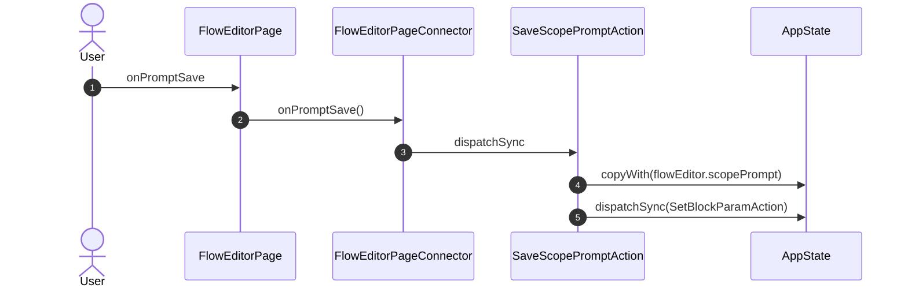
```mermaid
sequenceDiagram
    autonumber
    actor User
    participant UI as FlowEditorPage
    participant VM as FlowEditorPageConnector
    participant A1 as SaveScopePromptAction
    participant ST as AppState

    User->>UI: onPromptSave
    UI->>VM: onPromptSave()
    VM->>A1: dispatchSync
    A1->>ST: copyWith(flowEditor.scopePrompt)
    A1->>ST: dispatchSync(SetBlockParamAction)
```

## onPromptCancel

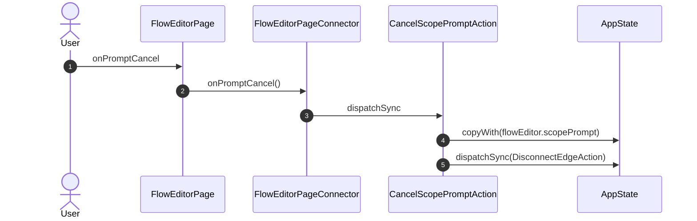
```mermaid
sequenceDiagram
    autonumber
    actor User
    participant UI as FlowEditorPage
    participant VM as FlowEditorPageConnector
    participant A1 as CancelScopePromptAction
    participant ST as AppState

    User->>UI: onPromptCancel
    UI->>VM: onPromptCancel()
    VM->>A1: dispatchSync
    A1->>ST: copyWith(flowEditor.scopePrompt)
    A1->>ST: dispatchSync(DisconnectEdgeAction)
```

## onRowAction

```mermaid
sequenceDiagram
    autonumber
    actor User
    participant UI as FlowEditorPage
    participant VM as FlowEditorPageConnector
    participant A1 as action

    User->>UI: onRowAction
    UI->>VM: onRowAction()
    alt action != null
        VM->>A1: dispatchSync
    end
```

## onOpen

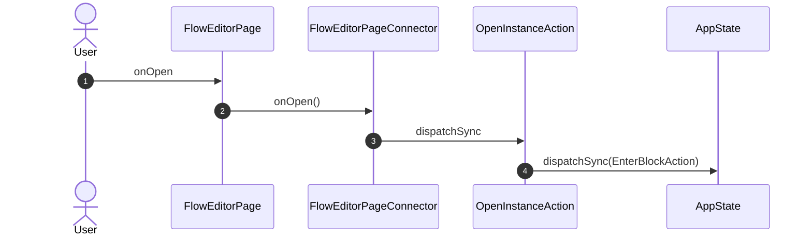
```mermaid
sequenceDiagram
    autonumber
    actor User
    participant UI as FlowEditorPage
    participant VM as FlowEditorPageConnector
    participant A1 as OpenInstanceAction
    participant ST as AppState

    User->>UI: onOpen
    UI->>VM: onOpen()
    VM->>A1: dispatchSync
    A1->>ST: dispatchSync(EnterBlockAction)
```

## onRun

```mermaid
sequenceDiagram
    autonumber
    actor User
    participant UI as FlowEditorPage
    participant VM as FlowEditorPageConnector
    participant A1 as action

    User->>UI: onRun
    UI->>VM: onRun()
    alt action != null
        VM->>A1: dispatchSync
    end
```

## onForm

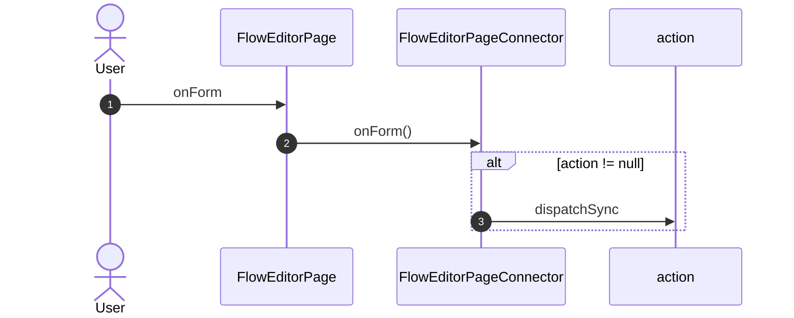
```mermaid
sequenceDiagram
    autonumber
    actor User
    participant UI as FlowEditorPage
    participant VM as FlowEditorPageConnector
    participant A1 as action

    User->>UI: onForm
    UI->>VM: onForm()
    alt action != null
        VM->>A1: dispatchSync
    end
```

## onOpenInside

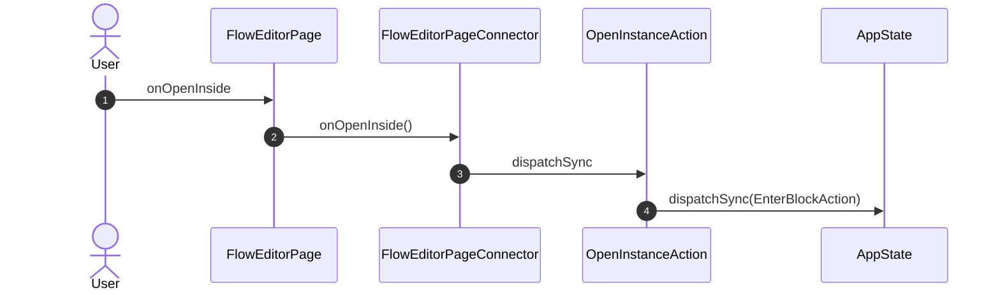
```mermaid
sequenceDiagram
    autonumber
    actor User
    participant UI as FlowEditorPage
    participant VM as FlowEditorPageConnector
    participant A1 as OpenInstanceAction
    participant ST as AppState

    User->>UI: onOpenInside
    UI->>VM: onOpenInside()
    VM->>A1: dispatchSync
    A1->>ST: dispatchSync(EnterBlockAction)
```

## newFlowName.onChanged

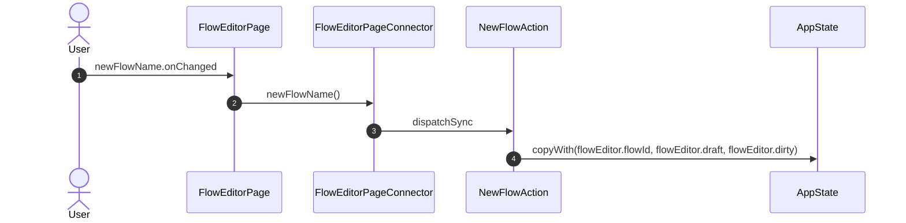
```mermaid
sequenceDiagram
    autonumber
    actor User
    participant UI as FlowEditorPage
    participant VM as FlowEditorPageConnector
    participant A1 as NewFlowAction
    participant ST as AppState

    User->>UI: newFlowName.onChanged
    UI->>VM: newFlowName()
    VM->>A1: dispatchSync
    A1->>ST: copyWith(flowEditor.flowId, flowEditor.draft, flowEditor.dirty)
```

## onView

```mermaid
sequenceDiagram
    autonumber
    actor User
    participant UI as FlowEditorPage
    participant VM as FlowEditorPageConnector
    participant A1 as action

    User->>UI: onView
    UI->>VM: onView()
    alt action != null
        VM->>A1: dispatchSync
    end
```

## onCloseViewer

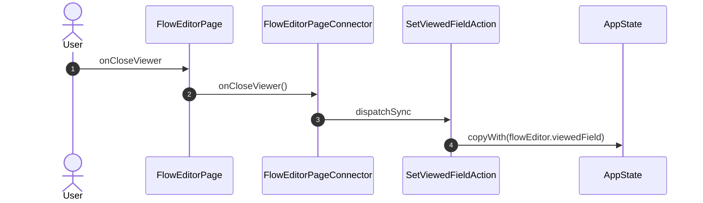
```mermaid
sequenceDiagram
    autonumber
    actor User
    participant UI as FlowEditorPage
    participant VM as FlowEditorPageConnector
    participant A1 as SetViewedFieldAction
    participant ST as AppState

    User->>UI: onCloseViewer
    UI->>VM: onCloseViewer()
    VM->>A1: dispatchSync
    A1->>ST: copyWith(flowEditor.viewedField)
```

## onDeploy

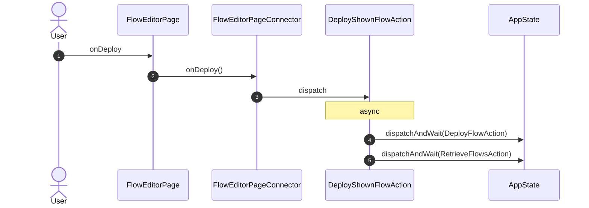
```mermaid
sequenceDiagram
    autonumber
    actor User
    participant UI as FlowEditorPage
    participant VM as FlowEditorPageConnector
    participant A1 as DeployShownFlowAction
    participant ST as AppState

    User->>UI: onDeploy
    UI->>VM: onDeploy()
    VM->>A1: dispatch
    Note over A1: async
    A1->>ST: dispatchAndWait(DeployFlowAction)
    A1->>ST: dispatchAndWait(RetrieveFlowsAction)
```

## onValidate

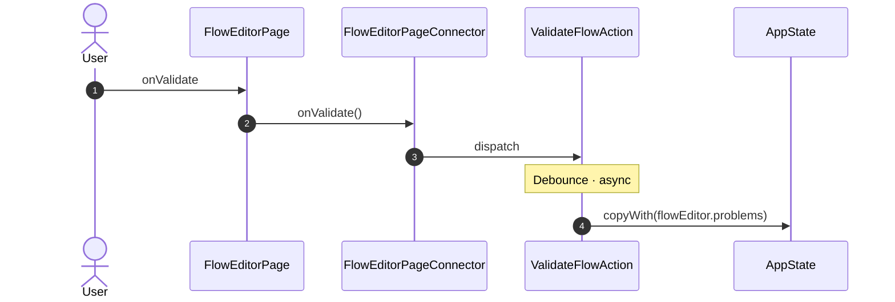
```mermaid
sequenceDiagram
    autonumber
    actor User
    participant UI as FlowEditorPage
    participant VM as FlowEditorPageConnector
    participant A1 as ValidateFlowAction
    participant ST as AppState

    User->>UI: onValidate
    UI->>VM: onValidate()
    VM->>A1: dispatch
    Note over A1: Debounce · async
    A1->>ST: copyWith(flowEditor.problems)
```

## onClose

```mermaid
sequenceDiagram
    autonumber
    actor User
    participant UI as FlowEditorPage
    participant VM as FlowEditorPageConnector
    participant NAV as Router

    User->>UI: onClose
    UI->>VM: onClose()
    VM->>NAV: GoAction.pop
```

## onPaletteTab

```mermaid
sequenceDiagram
    autonumber
    actor User
    participant UI as FlowEditorPage
    participant VM as FlowEditorPageConnector
    participant A1 as ShowPaletteTabAction
    participant ST as AppState

    User->>UI: onPaletteTab
    UI->>VM: onPaletteTab()
    VM->>A1: dispatch
    Note over A1: async
    A1->>ST: dispatchSync(_Shown)
    A1->>ST: dispatchAndWait(RetrieveBlockLibraryAction)
```

## onClear

```mermaid
sequenceDiagram
    autonumber
    actor User
    participant UI as FlowEditorPage
    participant VM as FlowEditorPageConnector
    participant A1 as SetSelectedBlockAction
    participant ST as AppState

    User->>UI: onClear
    UI->>VM: onClear()
    VM->>A1: dispatchSync
    A1->>ST: copyWith(flowEditor.selectedBlock, flowEditor.selection)
```

## onMove

```mermaid
sequenceDiagram
    autonumber
    actor User
    participant UI as FlowEditorPage
    participant VM as FlowEditorPageConnector
    participant A1 as m.action

    User->>UI: onMove
    UI->>VM: onMove()
    VM->>A1: dispatchSync
```

## onSelect

```mermaid
sequenceDiagram
    autonumber
    actor User
    participant UI as FlowEditorPage
    participant VM as FlowEditorPageConnector
    participant A1 as SetSelectedBlockAction
    participant ST as AppState

    User->>UI: onSelect
    UI->>VM: onSelect()
    VM->>A1: dispatchSync
    A1->>ST: copyWith(flowEditor.selectedBlock, flowEditor.selection)
```

## onSelectMany

```mermaid
sequenceDiagram
    autonumber
    actor User
    participant UI as FlowEditorPage
    participant VM as FlowEditorPageConnector
    participant A1 as SelectBlocksAction
    participant ST as AppState

    User->>UI: onSelectMany
    UI->>VM: onSelectMany()
    VM->>A1: dispatchSync
    A1->>ST: copyWith(flowEditor.selection, flowEditor.selectedBlock)
```

## onCommand

```mermaid
sequenceDiagram
    autonumber
    actor User
    participant UI as FlowEditorPage
    participant VM as FlowEditorPageConnector
    participant A1 as action

    User->>UI: onCommand
    UI->>VM: onCommand()
    alt action != null
        VM->>A1: dispatchSync
    end
```

## onPin

```mermaid
sequenceDiagram
    autonumber
    actor User
    participant UI as FlowEditorPage
    participant VM as FlowEditorPageConnector
    participant A1 as SetFieldPinAction
    participant ST as AppState

    User->>UI: onPin
    UI->>VM: onPin()
    VM->>A1: dispatchSync
    A1->>ST: copyWith(flowEditor.draft, flowEditor.dirty, flowEditor.undo, flowEditor.redo, flowEditor.undoTag)
```

## onFieldPin

```mermaid
sequenceDiagram
    autonumber
    actor User
    participant UI as FlowEditorPage
    participant VM as FlowEditorPageConnector
    participant A1 as action

    User->>UI: onFieldPin
    UI->>VM: onFieldPin()
    alt action != null
        VM->>A1: dispatchSync
    end
```

## onViewField

```mermaid
sequenceDiagram
    autonumber
    actor User
    participant UI as FlowEditorPage
    participant VM as FlowEditorPageConnector
    participant A1 as action

    User->>UI: onViewField
    UI->>VM: onViewField()
    alt action != null
        VM->>A1: dispatchSync
    end
```

## onSaveViewer

```mermaid
sequenceDiagram
    autonumber
    actor User
    participant UI as FlowEditorPage
    participant VM as FlowEditorPageConnector
    participant A1 as action

    User->>UI: onSaveViewer
    UI->>VM: onSaveViewer()
    alt action != null
        VM->>A1: dispatchSync
    end
```

## onBind

```mermaid
sequenceDiagram
    autonumber
    actor User
    participant UI as FlowEditorPage
    participant VM as FlowEditorPageConnector
    participant A1 as ConnectPortsAction
    participant ST as AppState

    User->>UI: onBind
    UI->>VM: onBind()
    VM->>A1: dispatchSync
    A1->>ST: copyWith(flowEditor.scopePrompt, flowEditor.draft, flowEditor.dirty, flowEditor.undo, flowEditor.redo, flowEditor.undoTag)
```

## onUnbind

```mermaid
sequenceDiagram
    autonumber
    actor User
    participant UI as FlowEditorPage
    participant VM as FlowEditorPageConnector
    participant A1 as action

    User->>UI: onUnbind
    UI->>VM: onUnbind()
    alt action != null
        VM->>A1: dispatchSync
    end
```

## onRebind

```mermaid
sequenceDiagram
    autonumber
    actor User
    participant UI as FlowEditorPage
    participant VM as FlowEditorPageConnector
    participant A1 as RebindFieldAction
    participant ST as AppState

    User->>UI: onRebind
    UI->>VM: onRebind()
    VM->>A1: dispatchSync
    A1->>ST: dispatchSync(RebindEdgeAction)
```

## onResize

```mermaid
sequenceDiagram
    autonumber
    actor User
    participant UI as FlowEditorPage
    participant VM as FlowEditorPageConnector
    participant A1 as ResizeBlockAction
    participant ST as AppState

    User->>UI: onResize
    UI->>VM: onResize()
    VM->>A1: dispatchSync
    A1->>ST: dispatchSync(isBoundary(block) ? ResizeBlockPortsAction(input: block == blockInputsId, add: add) : ResizeInputsAction(block, add: add))
```

## onFieldChanged

```mermaid
sequenceDiagram
    autonumber
    actor User
    participant UI as FlowEditorPage
    participant VM as FlowEditorPageConnector
    participant A1 as action

    User->>UI: onFieldChanged
    UI->>VM: onFieldChanged()
    alt action != null
        VM->>A1: dispatchSync
    end
```

## onFieldUnbind

```mermaid
sequenceDiagram
    autonumber
    actor User
    participant UI as FlowEditorPage
    participant VM as FlowEditorPageConnector
    participant A1 as action

    User->>UI: onFieldUnbind
    UI->>VM: onFieldUnbind()
    alt action != null
        VM->>A1: dispatchSync
    end
```

## onFieldBind

```mermaid
sequenceDiagram
    autonumber
    actor User
    participant UI as FlowEditorPage
    participant VM as FlowEditorPageConnector
    participant A1 as action

    User->>UI: onFieldBind
    UI->>VM: onFieldBind()
    alt action != null
        VM->>A1: dispatchSync
    end
```

## onRemove

```mermaid
sequenceDiagram
    autonumber
    actor User
    participant UI as FlowEditorPage
    participant VM as FlowEditorPageConnector
    participant A1 as RemoveBlocksAction
    participant ST as AppState

    User->>UI: onRemove
    UI->>VM: onRemove()
    VM->>A1: dispatchSync
    A1->>ST: copyWith(flowEditor.draft, flowEditor.selection, flowEditor.selectedBlock, flowEditor.dirty, flowEditor.undo, flowEditor.redo, flowEditor.undoTag)
```

## onLogo

```mermaid
sequenceDiagram
    autonumber
    actor User
    participant UI as FlowEditorPage
    participant VM as FlowEditorPageConnector
    participant NAV as Router

    User->>UI: onLogo
    UI->>VM: onLogo()
    VM->>NAV: GoAction.navigate ExplorerRoute
```

## onPanelWidth

```mermaid
sequenceDiagram
    autonumber
    actor User
    participant UI as FlowEditorPage
    participant VM as FlowEditorPageConnector
    participant A1 as SetPanelWidthAction
    participant ST as AppState

    User->>UI: onPanelWidth
    UI->>VM: onPanelWidth()
    VM->>A1: dispatchSync
    A1->>ST: copyWith(panels.widths)
```

_Not drawn — these files dispatch outside any interaction:_

- `FlowEditorPageConnector` — 3 dispatches

| Interaction | Dispatches | Writes |
| --- | --- | --- |
| `onBack` | `LeaveBlockAction` | `flowEditor.frames, flowEditor.draft, flowEditor.undo, flowEditor.redo, flowEditor.undoTag, flowEditor.selection, flowEditor.selectedBlock, flowEditor.viewedField, flowEditor.scopePrompt` |
| `onTreeToggle` | `ToggleTreeNodeAction` | — |
| `onTreeQuery` | `SetTreeQueryAction` | `flowEditor.treeQuery` |
| `onPlace` | `action` ? | — |
| `onPaletteMenu` | `action` ? | — |
| `onRenameBlock` | `action` ? | — |
| `onTreePlace` | `action` ? | — |
| `onCreateBlock` | `CreateCustomBlockAction.selected` | `flowEditor.draft, flowEditor.selection, flowEditor.selectedBlock, flowEditor.dirty, flowEditor.undo, flowEditor.redo, flowEditor.undoTag` |
| `onPromptSave` | `SaveScopePromptAction` | `flowEditor.scopePrompt` |
| `onPromptCancel` | `CancelScopePromptAction` | `flowEditor.scopePrompt` |
| `onRowAction` | `action` ? | — |
| `onOpen` | `OpenInstanceAction` | — |
| `onRun` | `action` ? | — |
| `onForm` | `action` ? | — |
| `onOpenInside` | `OpenInstanceAction` | — |
| `newFlowName.onChanged` | `NewFlowAction` | `flowEditor.flowId, flowEditor.draft, flowEditor.dirty` |
| `onView` | `action` ? | — |
| `onCloseViewer` | `SetViewedFieldAction` | `flowEditor.viewedField` |
| `onDeploy` | `DeployShownFlowAction` | — |
| `onValidate` | `ValidateFlowAction` | `flowEditor.problems` |
| `onClose` | `GoAction.pop` | — |
| `onPaletteTab` | `ShowPaletteTabAction` | — |
| `onClear` | `SetSelectedBlockAction` | `flowEditor.selectedBlock, flowEditor.selection` |
| `onMove` | `m.action` | — |
| `onSelect` | `SetSelectedBlockAction` | `flowEditor.selectedBlock, flowEditor.selection` |
| `onSelectMany` | `SelectBlocksAction` | `flowEditor.selection, flowEditor.selectedBlock` |
| `onCommand` | `action` ? | — |
| `onPin` | `SetFieldPinAction` | `flowEditor.draft, flowEditor.dirty, flowEditor.undo, flowEditor.redo, flowEditor.undoTag` |
| `onFieldPin` | `action` ? | — |
| `onViewField` | `action` ? | — |
| `onSaveViewer` | `action` ? | — |
| `onBind` | `ConnectPortsAction` | `flowEditor.scopePrompt, flowEditor.draft, flowEditor.dirty, flowEditor.undo, flowEditor.redo, flowEditor.undoTag` |
| `onUnbind` | `action` ? | — |
| `onRebind` | `RebindFieldAction` | — |
| `onResize` | `ResizeBlockAction` | — |
| `onFieldChanged` | `action` ? | — |
| `onFieldUnbind` | `action` ? | — |
| `onFieldBind` | `action` ? | — |
| `onRemove` | `RemoveBlocksAction` | `flowEditor.draft, flowEditor.selection, flowEditor.selectedBlock, flowEditor.dirty, flowEditor.undo, flowEditor.redo, flowEditor.undoTag` |
| `onLogo` | `GoAction.navigate` | — |
| `onPanelWidth` | `SetPanelWidthAction` | `panels.widths` |

`?` marks a dispatch that only runs under a condition.

[← all flows](README.md)
